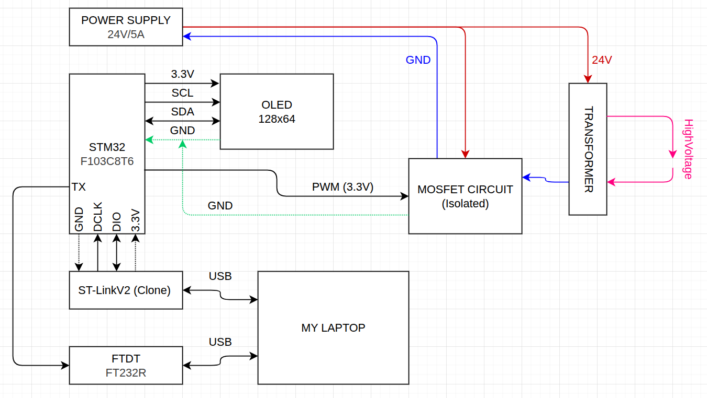
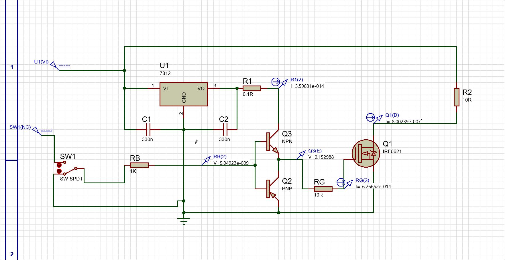
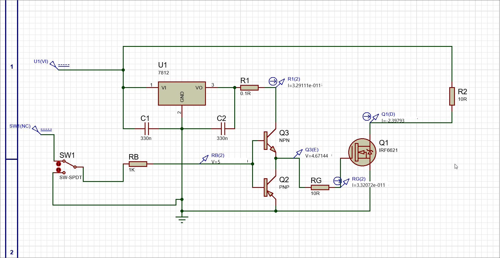

# High Voltage PWM Controller for Polymerization Catalysis

This project focuses on developing a precision power control system using an STM32 microcontroller to drive a Flyback transformer. The primary objective is to generate high-voltage output required to catalyze polymerization reactions.

# System Architecture

## System overview

The system is organized into several functional modules as illustrated in the picture below:

Control Unit: Centered around an STM32F103C8T6 microcontroller, which generates a 3.3V PWM signal to regulate the power output.

Power & High Voltage Stage:

- Power Supply: A 24V/5A source provides energy to the system.

- Isolated MOSFET Circuit: Acts as a high-speed switch to drive the transformer while protecting the logic side through electrical isolation.

- Flyback Transformer: Steps up the 24V input to the target High Voltage.

User Interface & Debugging:

- OLED Display (128x64): Connects via I2C (SCL/SDA) to provide real-time status monitoring.

- Programming & Communication: Utilizes an ST-LinkV2 for firmware flashing and an FT232R (USB to UART) module for serial data logging to a laptop.

## MOSFET Gate Driver Circuit with Totem-Pole Configuration

This circuit represents a robust Gate Driver stage designed to provide high-speed switching for a power MOSFET. It ensures efficient transition states to minimize switching losses, which is critical for high-frequency applications like your Flyback transformer controller.

### Key Circuit Components

- Voltage Regulation: A 7812 (U1) linear regulator is used to provide a stable 12V supply, ensuring consistent gate-source voltage (VGS​) for the MOSFET.

- Totem-Pole Driver: The core of the driver uses a complementary pair of transistors—an NPN (Q3) and a PNP (Q2). This configuration allows for high current sourcing and sinking to rapidly charge and discharge the MOSFET's gate capacitance.

- Power MOSFET: The output stage features an IRF6621 (Q1), a high-performance N-channel MOSFET suitable for efficient power switching.

### Passive Protection:

- RG (10R): A gate resistor is included to dampen oscillations and control the switching speed.

- C1/C2 (330n): Decoupling capacitors are placed around the regulator to maintain DC stability.

- Control Input: The circuit includes a switch (SW1) and a current-limiting resistor (RB) to simulate or trigger the input signal for the driver stage.

### Operational Summary

The circuit converts a low-power control signal into a high-current drive signal. By using the 12V regulated rail through the totem-pole transistors, it ensures the IRF6621 MOSFET switches fully "ON" and "OFF" with minimal delay, effectively managing the power delivered to the load (represented by R2).

